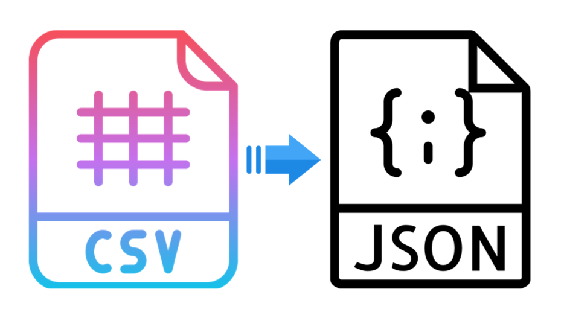

<p align="center">
  
</p>

<div align="center">

Reads a csv file or data variable having a table and returns an array of obects. In which each object consists of all headers as keys and there data as values.

</div>

## Installation

```
npm i --save csv-file-to-json
```

## Usage

`csv-file-to-json` support CommonJS.

### In module system

Use `filePath` key to provide `CSV data from file`.
```javascript
const csvToJson = require("csv-file-to-json");
const dataInJSON = csvToJSON({ filePath: "./filePath.csv" });
```
<br>

Use `data` key to provide `CSV data from variable or directly`.
```javascript
const csvToJSON = require("csv-file-to-json");
const dataInJSON = csvToJSON({ data: someCSVData });
```
<br>

#### Sample input (csv data) :
```
FIRST_NAME,LAST_NAME,NUMBER,EMAIL,ADDRESS
Debra,Burks,880012XXXX,debra.burks@yahoo.com,"9273 Thome Ave., `Orchard Park`, NY - 14127"
Kasha,Todd,null,kasha.todd@yahoo.com,"910, Vine Street!!!, (Campbell), CA - 95008"
Tameka,Fisher,8800111XXX,null,"7693 ~ Honey Creek St., Redondo Beach, "CA"      90278"
```

#### Sample output (json data) :
```
[
  {
    FIRST_NAME: 'Debra',
    LAST_NAME: 'Burks',
    NUMBER: '880012XXXX',
    EMAIL: 'debra.burks@yahoo.com',
    ADDRESS: '9273 Thome Ave., `Orchard Park`, NY - 14127'
  },
  {
    FIRST_NAME: 'Kasha',
    LAST_NAME: 'Todd',
    NUMBER: null,
    EMAIL: 'kasha.todd@yahoo.com',
    ADDRESS: '910, Vine Street!!!, (Campbell), CA - 95008'
  },
  {
    FIRST_NAME: 'Tameka',
    LAST_NAME: 'Fisher',
    NUMBER: '880111XXXX',
    EMAIL: null,
    ADDRESS: '7693 ~ Honey Creek St., Redondo Beach, "CA"      90278'
  }
]
```
<br>

Use `separator` key to specific your separator. `Default separator is ","`.
```javascript
const dataInJSON = csvToJSON({ filePath: "./filePath.txt", separator: "," });
```
<br>

Use `hasHeader` key to specify if your file or data contains a header line or not.<br>
`Default is true and first line will be taken has header line`
```javascript
const dataInJSON = csvToJSON({ filePath: "./filePath.txt", hasHeader: true });
```
<br>

Use `headers` key to specify your own headers.
```javascript
const dataInJSON = csvToJSON({ filePath: "./filePath.txt", hasHeader: false, headers: ["FIRST_NAME", "LAST_NAME", "NUMBER", "EMAIL", "ADDRESS"] });
```
<br>

# References
* To convert text and csv both to json. Try - https://www.npmjs.com/package/data-to-json
* To convert only txt data to json. Try - https://www.npmjs.com/package/txt-file-to-json
